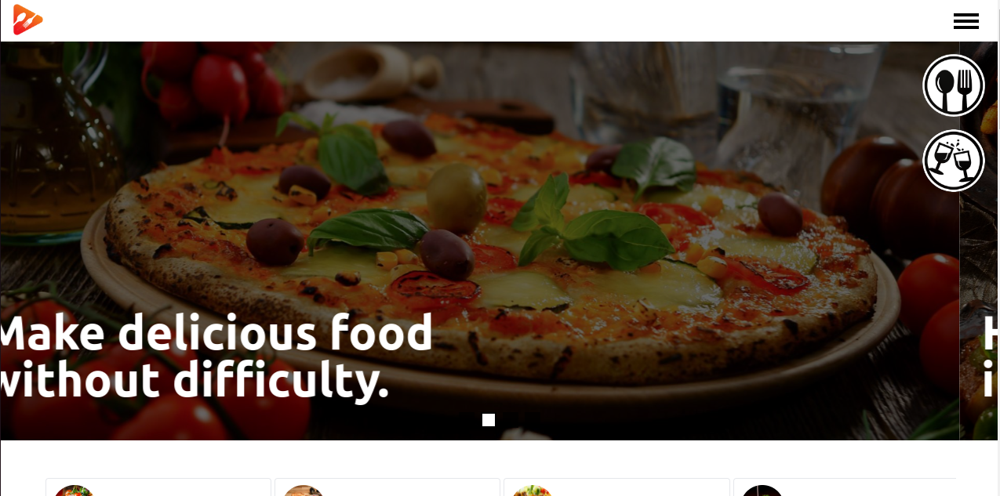

<h1 align="center">Recipes</h1>

Aplicação de receitas que utiliza o que há de mais moderno dentro do ecossistema React: Hooks e Context API!

<h3 align="center">https://brunocabralsilva.github.io/trybe-20-recipes/</h3>

<h2> Índice</h2>

* [Introdução](#intro)
* [Descrição do Projeto](#descrição-do-projeto)
* [Mapeamento do Site](#mapeamento)
* [Tecnologias utilizadas](#tecnologias-utilizadas)
* [Desenvolvedores e demais contribuidores](#pessoas-envolvidas)
* [Conclusão](#conclusão)

<h2 id="intro">Introdução</h2>

Visando a evolução e aprendizado dentro dá área de front end, a trybe nos direcionou a criar uma aplicação onde fosse possível:

<ul>
  <li>Utilizar Redux para gerenciar estado;</li>
  <li>Utilizar a biblioteca React-Redux;</li>
  <li>Utilizar a Context API do React para gerenciar estado;</li>
  <li>Utilizar o React Hook useState;</li>
  <li>Utilizar o React Hook useContext;</li>
  <li>Utilizar o React Hook useEffect;</li>
  <li>Criar Hooks customizados;</li>
</ul>

<h2 id="descrição-do-projeto">Descrição do Projeto</h2>

  A aplicação em questão permite que o usuário possa ver, buscar, filtrar, favoritar e acompanhar o progresso de preparação de receitas e drinks, sendo assistido por uma interface agradável e que contribui para a experiência do usuário.

<h2 id="mapeamento">Mapeamento do site </h2>

<ol>
<li><h4>Login</h4></li> 

  Para ter acesso às ferramentas do site, o usuário deve digitar um e-mail válido, bem como uma senha de seis dígitos. Este e-mail fica salvo no local storage e pode ser visualizado na área de perfil.

 

<li><h4>Receitas</h4></li> 

  Após digitar realizar o login de forma efetiva, o usuário tem acesso a duas páginas de funções semelhantes, sendo uma para bebidas e outra para comidas. Esta última é a primeira a ser carregada na tela por padrão, mas o usuário pode alterar para a outra clicando no botão fixo na parte inferior direita.

  Cada página possui seis filtros localizados na área superior logo abaixo do cabeçalho e cada um deles traz 12 opções a serem visualizadas e escolhidas pelo usuário. São elas:

   
  
Para Comidas:

  <ul>
    <li>All</li>
    <li>Beef</li>
    <li>BreakFast</li>
    <li>Chicken</li>
    <li>Dessert</li>
    <li>Goat</li>
  </ul>
   
  
Para Bebidas:

  <ul>
    <li>All</li>
    <li>Ordinary Drink</li>
    <li>Cocktail</li>
    <li>Shake</li>
    <li>Others</li>
    <li>Cocoa</li>
  </ul>

  No cabeçalho, há duas outras opções disponíveis: O ícone de perfil redireciona o usuário para a área de perfil e o ícone de pesquisa permite que o usuário busque receitas ou bebidas, seja pelo ingrediente, nome ou primeira letra.

  Por fim, caso o usuário clique em uma das bebidas ou comidas disponibilizadas, ele é redirecionado para a página de detalhes.

 

Ao clicar uma vez, o item da lista selecionado é adicionado e pode ser visualizado em um pop-up no canto superior direito da tela. Ele pode ser removido clicando novamente no ícone ou desmarcando o checkbox referente ao mesmo no pop-up.

Ao clicar em buscar, a aplicação retorna uma lista com todos os dons que se adequam aos filtros selecionados.

a seu perfil, onde poderá ver informações como e-mail cadastrado, receitas prontas e favoritas, assim como fazer logout. 

<li><h4>Detalhes</h4></li>

  Ao clicar em uma comida ou bebida disponibilizada pela aplicação, o usuário é redirecionado para uma página com detalhes sobre a mesma. Aém de uma imagem ampliada do item e seu nome, o usuário pode ver a receita e, segundo sua vontade, favoritar ou compartilhar a receita.

  Caso queira realizar a receita com a ajuda da aplicação, ele pode clicar em Continue/Start Recipe.

<li><h4>Receitas em Progresso</h4></li>

  Assim como na tela anterior, o usuário poderá visualizar uma imagem ampliada da receita e seu nome, somado agora a uma descrição de como preparar a comida ou bebida. Abaixo das opções de favoritar e compartilhar que também continuam disponíveis, existe um passo a passo de como concluir a receita, onde cada item possui um checkbox que pode ser marcado ao ser concluído. Estas marcações ficam salvas no local storage e mesmo que o usuário atualize ou saia do aplicativo, elas continuarão marcadas (A não ser que o usuário clique em logout, que apagará tudo o que ficou salvo no login do usuário).

 Ao marcar todos os itens do passo a passo, um botão finalizar será habilitado para o usuário no canto inferior direito, que o direcionará para a página de receitas concluídas.

<li><h4>Receitas concluídas</h4></li>

  Página destinada a exibir todas as receitas que o usuário concluiu, ou seja, seguiu e marcou todos os tópicos do passo a passo. O usuário pode filtrar as receitas concluídas por bebida, comida, ou ambas as opções.

  Para cada item concluído, é possível verificar a data em que foi concluído e também compartilhar.

<li><h4>Receitas Favoritadas</h4></li>

  Página destinada a exibir todas as receitas favoritadas pelo o usuário. Estas podem ser filtradas por bebida, comida, ou ambas as opções. O usuário tem acesso a esta página por meio da página de perfil.

<li><h4>Perfil</h4></li>

  Área destinada a apresentar algumas informações do usuário, como o e-mail que ele disponibilizou ao realizar o login, suas receitas concluídas e também as receitas favoritas. Há também a opção de logout, onde o usuário limpará do local storage todas as informações salvas e nenhum registro restará sobre a sua jornada na aplicação.

</ol>

<h2 id="tecnologias-utilizadas">Tecnologias utilizadas</h2>

* `HTML5`
* `CSS3`
* `Javascript (ECMAScript 2018)`
* `React`
* `React Icons`
* `React Router Dom`
* `React Context`
* `Framer Motion`
* `Tailwind CSS`

<h2 id="pessoas-envolvidas">Desenvolvedores e demais contribuidores</h2>

* <strong>Bruno Gabryell Cabral da Silva</strong> - Desenvolvedor Web - React e Tailwind CSS;
* <strong>Thiago Gasparini</strong> - Desenvolvedor Web - React;
* <strong>Roiney Beal</strong> - Desenvolvedor Web - React;
* <strong>Thiago Flexa</strong> - Desenvolvedor Web - React;
* <strong>Thiago Carvalho</strong> - Desenvolvedor Web - React;

<h2 id="conclusão">Conclusão</h2>

Programar é um eterno aprendizado. Quanto mais se pratica, mais se melhora. Praticar conceitos de programação com coisas que se é apaixonado apimenta ainda mais a relação! Muitos aprendizados novos são adicionados a cada dia, fazendo com que este projeto já tenha valido a pena antes mesmo de ser concluído!

